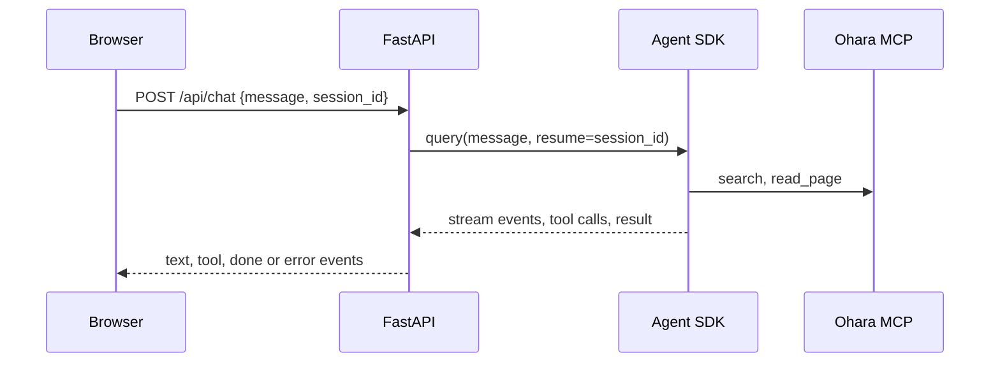

# Architecture

## Components

| Module | Owns |
|---|---|
| `backend/agent_template/config.py` | Settings. The only module that reads the environment |
| `backend/agent_template/agent.py` | The Agent SDK options, a chat turn as a stream of events, and the history of a session |
| `backend/agent_template/main.py` | The routes, and serving the built frontend under the base path |
| `frontend/src/api.ts` | Every server call: the base path, the response types, and reading the event stream |
| `frontend/src/Chat.tsx` | The chat screen |

## A chat turn

1. The browser sends the message and the session id it holds, if any.
2. The backend runs one turn with `query()`. It resumes the session when there is an id.
3. The SDK runs the Claude Code agent loop in a subprocess, and calls the Ohara tools when the agent needs them.
4. The backend turns SDK messages into server-sent events, one JSON object per `data:` line:

| Event | Fields | Sent when |
|---|---|---|
| `text` | `delta` | The agent writes text |
| `tool` | `name`, `input` | The agent calls a tool |
| `done` | `session_id` | The turn ends. The browser stores the id for the next turn |
| `error` | `message` | The turn fails. The message says what happened and what to do |

## Routes

| Route | Purpose |
|---|---|
| `POST /api/chat` | Run one turn. Body: `message` (1 to 10,000 characters) and an optional `session_id` (a UUID). Returns `text/event-stream` |
| `GET /api/chat/{session_id}` | The user and assistant text of a past session, so a reloaded page shows it. `404` when the session doesn't exist |
| `GET /` | The chat, with the base path written into the page |

## State

| State | Where |
|---|---|
| Session transcripts | The SDK's JSONL files under `/data/claude`, on the data volume |
| The agent's working directory | `/data/workspace`. Empty, since built-in tools are off |
| The current session id | The browser's `localStorage`. "New chat" clears it |

The backend keeps nothing in memory between requests, so a restart loses nothing.

## Tools

Built-in Claude Code tools (Read, Write, Bash, and the rest) are off: `tools=[]`. Host settings and `CLAUDE.md` files are ignored: `setting_sources=[]`.

When `OHARA_MCP_URL` is set, the agent connects to that Ohara server and gets its read-only tools without a prompt: `list_pages`, `search`, `read_page`, `stale_pages`. `propose_change`, `check_repository`, and `import_docs` are blocked, since nobody confirms them in the chat.

To add a tool, define it with the SDK's `@tool` decorator, serve it with `create_sdk_mcp_server()`, and add the server and the tool's name to `options()` in `agent.py`.

## Access

The chat has no sign-in. Compose publishes it on `127.0.0.1` only. Don't expose it to a network you don't trust: anyone who reaches it spends your Claude credits and reads your docs.
